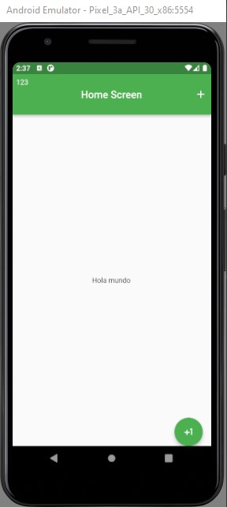

# flutter_guide_2024

Proyecto guía que muestra el uso de los diferentes Widgets de Flutter.

## Configurar e instalación de flutter
- [get started](https://docs.flutter.dev/get-started/codelab)

## Ejemplos prácticos
- [Cookbook: Useful Flutter samples](https://docs.flutter.dev/cookbook)

## Documentación de ayuda
[online documentation](https://docs.flutter.dev/)

## Catalogo de Widgets
[Widget catalog](https://docs.flutter.dev/ui/widgets/)

## Screenshots
